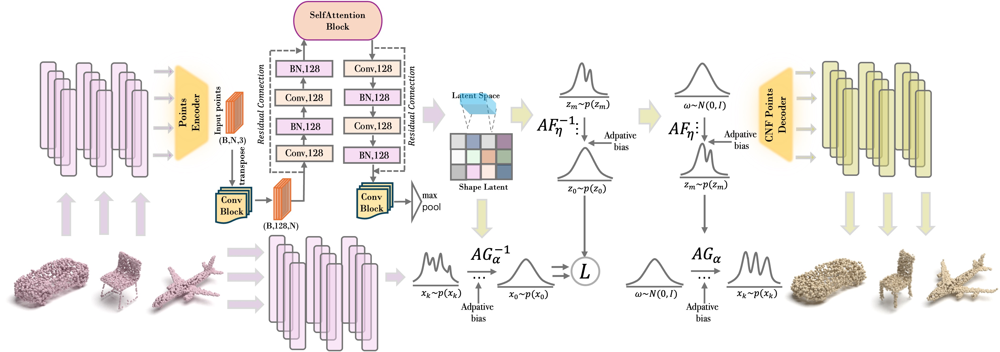
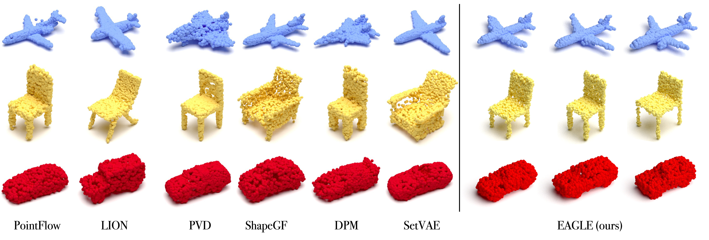

# EAGLE : Contextual Point Cloud Generation via Adaptive Continuous Normalizing Flow with Self-Attention

[Linhao Wang](https://github.com/wanglh300), 
[Qichang Zhang](https://openreview.net/profile?id=~Qichang_Zhang1), 
[Yifan Yang](https://openreview.net/profile?id=~Yifan_Yang28), 
[Hao Wang*](https://scholar.google.com.hk/citations?user=VaryZeIAAAAJ&hl=zh-CN)
(*Corresponding Author)

We greatly appreciate the contribution of [PointFlow](https://github.com/stevenygd/PointFlow), as our work is based on it. You can refer to it in order to reproduce the project. The repository provides the introduction of EAGLE. Have fun!

## Abstract
As 3D point clouds become the prevailing shape representation in computer vision, how to generate high-resolution point clouds has become a pressing issue. Flow-based generative models can effectively perform point cloud generation tasks. However, traditional CNN-based flow architectures rely only on local information to extract features, making it difficult to capture global contextual information. Inspired by the wide adoption of Transformers, we explored the complementary roles of self-attention mechanisms in Transformers, CNN, and continuous normalizing flows. To this end, we propose a probabilistic model via adaptive normalizing flows and self-attention. Our idea leverages self-attention mechanisms to capture global contextual information. We also propose adaptive continuous normalizing flows by introducing adaptive bias correction mechanism. Combined with normalization, the mechanism dynamically handles different input contexts and mitigates potential bias-shift issues from standard initialization. Experimental results demonstrate that EAGLE achieves competitive performance in point cloud generation.

## Flowchart Overview
<p align="center">
   
</p>
Visualization of the entire flowchart of our method. A residual block is placed before and after the SelfAttention block. During the training time, the input points are consumed by Points Encoder which infers a posterior over shape representations. We use the two proposed reversed flows to compute the prior distribution and reconstruction likelihood based on the shape latent. Two forward flows are periodically used to perform generative validation on the model. The ConvBlock consists of a 1D convolution layer, a BatchNorm layer, and a ReLU activation function.

## Qualitative Comparisons
<p align="center">
   
</p>


## References
- PointFlow: https://github.com/stevenygd/PointFlow

## Cite
Please cite our work if you find it useful:
```latex
@article{wang2025eagle,
  title={EAGLE: Contextual Point Cloud Generation via Adaptive Continuous Normalizing Flow with Self-Attention},
  author={Wang, Linhao and Zhang, Qichang and Yang, Yifan and Wang, Hao},
  journal={arXiv preprint arXiv:2503.13479},
  year={2025}
}
```

